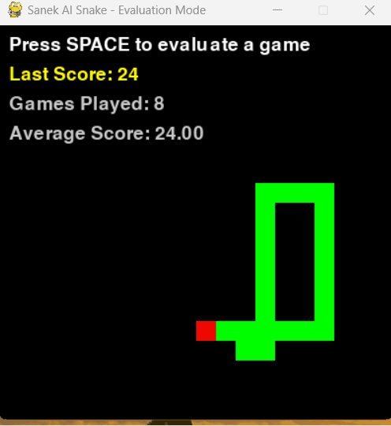
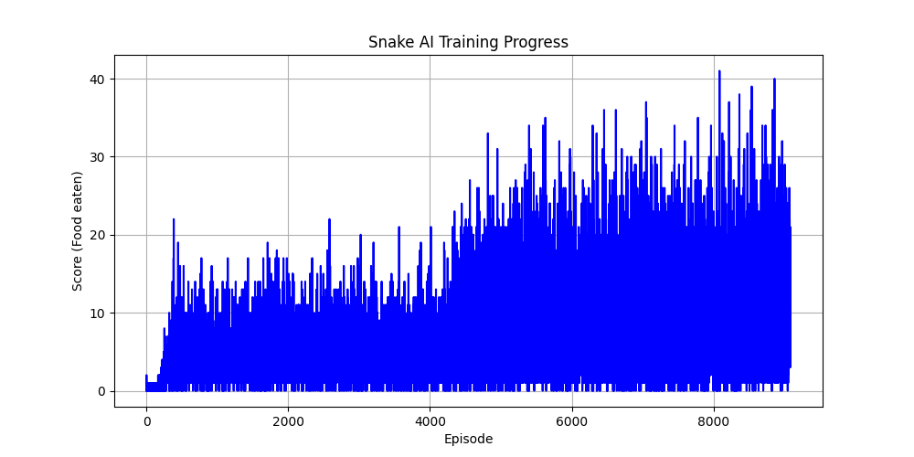

#  Sanek AI – Snake Game with Reinforcement Learning

Sanek is an AI-powered Snake game built entirely from scratch using Python.  
The snake learns how to play by itself using Q-learning and a simple custom-built neural network.  
The project includes real-time training, model evaluation, and gameplay visualization using Pygame.

---

##  Project Highlights

- Q-learning with custom neural network (no external ML libraries)
- Self-learning snake with auto-restart after game over
- Automatically saves best model and best score
- Evaluate and compare all saved models
- Visual training evolution and gameplay demo

---

##  Evaluation (500 Episodes)

**Average Score:** 26.64  
**Minimum Score:** 10  
**Maximum Score:** 48

---

##  Training Progress

After 8000+ episodes, the snake gets smarter:

---

##  Project Structure

ai-snake-rl/
ai-snake-rl/
├── models/                     # Saved model files (.npz)
├── agent.py                   # Q-learning agent logic
├── neural_network.py          # Custom neural network
├── game.py                    # Game loop, training, evaluation
├── best_score.txt             # Stores highest score
├── snake_play.gif             # Snake gameplay animation
└── snake_training_evolution.png  # Training progress chart

---

## Requirements

pip install pygame numpy matplotlib

